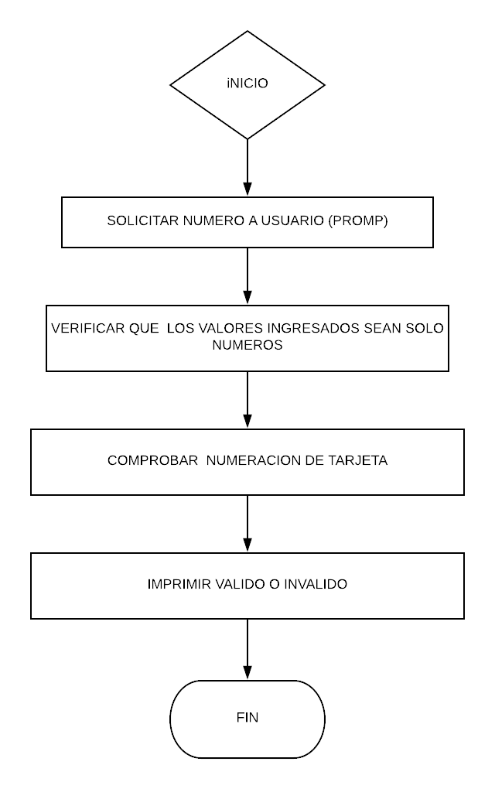

# TARJETA DE CRÉDITO VÁLIDA
### Descripción:
se trata de una web que pida, por medio de un prompt(), el número de una tarjeta de crédito y confirme su validez según el algoritmo de Luhn.
El código debe estar compuesto por 1 función: isValidCard
El usuario no debe poder ingresar un campo vacío

## **Pseudocodigo**
### Descripcion:
1.- Solicitar un número de tarjeta

2.- Verificar que se ingresen solo numeros

3.-Comprobar que la numeracion sea valida.

4.-visualizar resultado valido/invalido

# **Diagrama de flujo**
### Descripcion

tarjeta-de-credito
